# SABDA 99 POS — Concrete ERD

> **Status:** Database Design Baseline  
> **Source:** `SABDA_99_POS_Domain_Model.md` + `SABDA_99_POS_Foundation.md`  
> **Purpose:** concrete relational model sebelum Prisma schema dan implementation.
>
> **Important:** ERD ini menerjemahkan domain model menjadi relational database. Beberapa field/FK yang tidak eksplisit di domain model ditambahkan sebagai konsekuensi teknis agar relational model konsisten; bagian tersebut ditandai sebagai **design decision**.

---

## 1. ERD — Mermaid

> Diagram ini dapat langsung dirender oleh GitHub, GitLab, Obsidian, atau Mermaid-compatible Markdown viewer.

```mermaid
erDiagram

    OUTLET {
        uuid id PK
        varchar name
        text address
        boolean is_active
        timestamptz created_at
        timestamptz updated_at
    }

    FLOOR {
        uuid id PK
        uuid outlet_id FK
        varchar name
        text description
        timestamptz created_at
        timestamptz updated_at
    }

    TABLE {
        uuid id PK
        uuid outlet_id FK
        uuid floor_id FK
        varchar number
        int capacity
        varchar qr_token UK
        boolean is_active
        timestamptz created_at
        timestamptz updated_at
    }

    TABLE_SESSION {
        uuid id PK
        uuid outlet_id FK
        uuid table_id FK
        int guest_count
        varchar status
        timestamptz opened_at
        timestamptz closed_at
        timestamptz created_at
        timestamptz updated_at
    }

    CATEGORY {
        uuid id PK
        varchar name
        int sort_order
        boolean is_active
        timestamptz created_at
        timestamptz updated_at
    }

    PRODUCT {
        uuid id PK
        uuid category_id FK
        varchar sku UK
        varchar name
        text description
        decimal price
        text image
        boolean is_active
        timestamptz created_at
        timestamptz updated_at
    }

    MODIFIER_GROUP {
        uuid id PK
        varchar name
        varchar selection_type
        int min_selection
        int max_selection
        boolean is_required
        timestamptz created_at
        timestamptz updated_at
    }

    MODIFIER {
        uuid id PK
        uuid modifier_group_id FK
        varchar name
        decimal price_adjustment
        boolean is_active
        timestamptz created_at
        timestamptz updated_at
    }

    PRODUCT_MODIFIER_GROUP {
        uuid product_id PK,FK
        uuid modifier_group_id PK,FK
    }

    ORDER {
        uuid id PK
        uuid outlet_id FK
        uuid table_session_id FK
        varchar order_number UK
        varchar channel
        varchar status
        decimal subtotal
        decimal discount_amount
        decimal tax_amount
        decimal total_amount
        text notes
        timestamptz created_at
        timestamptz confirmed_at
        timestamptz completed_at
        timestamptz cancelled_at
    }

    ORDER_ITEM {
        uuid id PK
        uuid order_id FK
        uuid product_id FK
        varchar product_name_snapshot
        decimal unit_price_snapshot
        decimal quantity
        decimal subtotal
        text notes
        timestamptz created_at
    }

    ORDER_ITEM_MODIFIER {
        uuid id PK
        uuid order_item_id FK
        uuid modifier_id FK
        varchar modifier_name_snapshot
        decimal price_adjustment_snapshot
        timestamptz created_at
    }

    PAYMENT_METHOD {
        uuid id PK
        uuid outlet_id FK
        varchar name
        varchar type
        boolean is_active
        timestamptz created_at
        timestamptz updated_at
    }

    PAYMENT {
        uuid id PK
        uuid order_id FK
        uuid payment_method_id FK
        decimal amount
        varchar status
        varchar reference
        timestamptz paid_at
        timestamptz confirmed_at
        uuid confirmed_by FK
        timestamptz created_at
    }

    FULFILLMENT {
        uuid id PK
        uuid order_id FK,UK
        varchar status
        timestamptz queued_at
        timestamptz served_at
        timestamptz completed_at
        timestamptz created_at
        timestamptz updated_at
    }

    PRINTER {
        uuid id PK
        uuid outlet_id FK
        varchar name
        varchar type
        varchar address
        boolean is_active
        timestamptz created_at
        timestamptz updated_at
    }

    KITCHEN_ORDER_TICKET {
        uuid id PK
        uuid order_id FK
        uuid printer_id FK
        uuid printed_by FK
        int print_count
        timestamptz printed_at
    }

    UOM {
        uuid id PK
        varchar code UK
        varchar name
        varchar type
        timestamptz created_at
        timestamptz updated_at
    }

    INVENTORY_ITEM {
        uuid id PK
        varchar sku UK
        varchar name
        varchar item_type
        uuid uom_id FK
        decimal cost
        decimal reorder_level
        boolean is_active
        timestamptz created_at
        timestamptz updated_at
    }

    WAREHOUSE {
        uuid id PK
        uuid outlet_id FK
        varchar name
        varchar code
        boolean is_active
        timestamptz created_at
        timestamptz updated_at
    }

    STOCK {
        uuid id PK
        uuid warehouse_id FK
        uuid inventory_item_id FK
        decimal quantity
        timestamptz updated_at
    }

    STOCK_MOVEMENT {
        uuid id PK
        uuid warehouse_id FK
        uuid inventory_item_id FK
        varchar type
        decimal quantity
        varchar reference_type
        uuid reference_id
        timestamptz occurred_at
    }

    RECIPE {
        uuid id PK
        uuid product_id FK
        int version
        boolean is_active
        timestamptz created_at
        timestamptz updated_at
    }

    RECIPE_ITEM {
        uuid id PK
        uuid recipe_id FK
        uuid inventory_item_id FK
        uuid uom_id FK
        decimal quantity
    }

    MODIFIER_RECIPE_ITEM {
        uuid id PK
        uuid modifier_id FK
        uuid inventory_item_id FK
        uuid uom_id FK
        decimal quantity
    }

    SUPPLIER {
        uuid id PK
        varchar name
        varchar contact
        text address
        text payment_terms
        boolean is_active
        timestamptz created_at
        timestamptz updated_at
    }

    PURCHASE_REQUEST {
        uuid id PK
        uuid outlet_id FK
        uuid requested_by FK
        varchar status
        timestamptz requested_at
        timestamptz created_at
    }

    PURCHASE_REQUEST_ITEM {
        uuid id PK
        uuid purchase_request_id FK
        uuid inventory_item_id FK
        uuid uom_id FK
        decimal quantity
    }

    PURCHASE_ORDER {
        uuid id PK
        uuid outlet_id FK
        uuid supplier_id FK
        uuid purchase_request_id FK
        varchar order_number UK
        varchar status
        timestamptz ordered_at
        timestamptz created_at
    }

    PURCHASE_ORDER_ITEM {
        uuid id PK
        uuid purchase_order_id FK
        uuid inventory_item_id FK
        decimal quantity
        decimal received_quantity
        decimal unit_price
    }

    GOODS_RECEIPT {
        uuid id PK
        uuid purchase_order_id FK
        uuid warehouse_id FK
        varchar receipt_number UK
        varchar status
        uuid received_by FK
        timestamptz received_at
        timestamptz created_at
    }

    GOODS_RECEIPT_ITEM {
        uuid id PK
        uuid goods_receipt_id FK
        uuid inventory_item_id FK
        decimal ordered_quantity
        decimal received_quantity
        decimal unit_cost
    }

    STOCK_TRANSFER {
        uuid id PK
        uuid from_warehouse_id FK
        uuid to_warehouse_id FK
        varchar status
        timestamptz transferred_at
        timestamptz created_at
    }

    STOCK_TRANSFER_ITEM {
        uuid id PK
        uuid stock_transfer_id FK
        uuid inventory_item_id FK
        decimal quantity
    }

    STOCK_OPNAME {
        uuid id PK
        uuid warehouse_id FK
        uuid performed_by FK
        varchar status
        timestamptz performed_at
        timestamptz created_at
    }

    STOCK_OPNAME_ITEM {
        uuid id PK
        uuid stock_opname_id FK
        uuid inventory_item_id FK
        decimal system_quantity
        decimal actual_quantity
        decimal variance
    }

    WASTE {
        uuid id PK
        uuid warehouse_id FK
        uuid recorded_by FK
        text reason
        timestamptz occurred_at
        timestamptz created_at
    }

    WASTE_ITEM {
        uuid id PK
        uuid waste_id FK
        uuid inventory_item_id FK
        uuid uom_id FK
        decimal quantity
    }

    USER {
        uuid id PK
        uuid outlet_id FK
        varchar name
        varchar email UK
        varchar password_hash
        boolean is_active
        timestamptz created_at
        timestamptz updated_at
    }

    ROLE {
        uuid id PK
        varchar name UK
        text description
    }

    PERMISSION {
        uuid id PK
        varchar code UK
        varchar name
        text description
    }

    USER_ROLE {
        uuid user_id PK,FK
        uuid role_id PK,FK
    }

    ROLE_PERMISSION {
        uuid role_id PK,FK
        uuid permission_id PK,FK
    }

    SHIFT {
        uuid id PK
        uuid outlet_id FK
        uuid user_id FK
        varchar status
        decimal opening_cash
        decimal expected_cash
        decimal actual_cash
        decimal variance
        timestamptz opened_at
        timestamptz closed_at
        timestamptz created_at
    }

    CASH_MOVEMENT {
        uuid id PK
        uuid shift_id FK
        varchar type
        decimal amount
        text reason
        varchar reference_type
        uuid reference_id
        uuid created_by FK
        timestamptz created_at
    }

    TAX {
        uuid id PK
        uuid outlet_id FK
        varchar name
        decimal rate
        boolean is_active
    }

    DISCOUNT {
        uuid id PK
        uuid outlet_id FK
        varchar name
        varchar type
        decimal value
        boolean is_active
    }

    PROMOTION {
        uuid id PK
        uuid outlet_id FK
        varchar name
        varchar type
        timestamptz starts_at
        timestamptz ends_at
        boolean is_active
    }

    AUDIT_LOG {
        uuid id PK
        uuid outlet_id FK
        uuid user_id FK
        varchar action
        varchar entity_type
        uuid entity_id
        json metadata
        timestamptz created_at
    }

    OUTLET ||--o{ FLOOR : contains
    OUTLET ||--o{ TABLE : owns
    FLOOR ||--o{ TABLE : contains

    TABLE ||--o{ TABLE_SESSION : has
    OUTLET ||--o{ TABLE_SESSION : operates

    TABLE_SESSION ||--o{ ORDER : contains
    OUTLET ||--o{ ORDER : owns
    ORDER ||--|{ ORDER_ITEM : contains

    CATEGORY ||--o{ PRODUCT : groups
    PRODUCT ||--o{ ORDER_ITEM : sold_as

    PRODUCT ||--o{ PRODUCT_MODIFIER_GROUP : has
    MODIFIER_GROUP ||--o{ PRODUCT_MODIFIER_GROUP : assigned_to
    MODIFIER_GROUP ||--o{ MODIFIER : contains
    MODIFIER ||--o{ ORDER_ITEM_MODIFIER : selected_as
    ORDER_ITEM ||--o{ ORDER_ITEM_MODIFIER : contains

    ORDER ||--o{ PAYMENT : paid_by
    PAYMENT_METHOD ||--o{ PAYMENT : used_by
    PAYMENT ||--o| USER : confirmed_by

    ORDER ||--o| FULFILLMENT : fulfills
    ORDER ||--o{ KITCHEN_ORDER_TICKET : generates
    PRINTER ||--o{ KITCHEN_ORDER_TICKET : prints
    USER ||--o{ KITCHEN_ORDER_TICKET : printed_by

    UOM ||--o{ INVENTORY_ITEM : default_uom
    OUTLET ||--o{ WAREHOUSE : owns
    WAREHOUSE ||--o{ STOCK : contains
    INVENTORY_ITEM ||--o{ STOCK : stocked_as
    WAREHOUSE ||--o{ STOCK_MOVEMENT : records
    INVENTORY_ITEM ||--o{ STOCK_MOVEMENT : moves

    PRODUCT ||--o{ RECIPE : has
    RECIPE ||--|{ RECIPE_ITEM : contains
    INVENTORY_ITEM ||--o{ RECIPE_ITEM : consumed
    UOM ||--o{ RECIPE_ITEM : measured_in

    MODIFIER ||--o{ MODIFIER_RECIPE_ITEM : consumes
    INVENTORY_ITEM ||--o{ MODIFIER_RECIPE_ITEM : consumed
    UOM ||--o{ MODIFIER_RECIPE_ITEM : measured_in

    SUPPLIER ||--o{ PURCHASE_ORDER : receives_orders
    PURCHASE_REQUEST ||--o{ PURCHASE_ORDER : converted_to
    OUTLET ||--o{ PURCHASE_REQUEST : owns
    USER ||--o{ PURCHASE_REQUEST : requested_by
    PURCHASE_REQUEST ||--|{ PURCHASE_REQUEST_ITEM : contains
    INVENTORY_ITEM ||--o{ PURCHASE_REQUEST_ITEM : requested
    UOM ||--o{ PURCHASE_REQUEST_ITEM : measured_in

    PURCHASE_ORDER ||--|{ PURCHASE_ORDER_ITEM : contains
    INVENTORY_ITEM ||--o{ PURCHASE_ORDER_ITEM : ordered

    PURCHASE_ORDER ||--o{ GOODS_RECEIPT : received_through
    WAREHOUSE ||--o{ GOODS_RECEIPT : receives
    USER ||--o{ GOODS_RECEIPT : received_by
    GOODS_RECEIPT ||--|{ GOODS_RECEIPT_ITEM : contains
    INVENTORY_ITEM ||--o{ GOODS_RECEIPT_ITEM : received

    WAREHOUSE ||--o{ STOCK_TRANSFER : source
    WAREHOUSE ||--o{ STOCK_TRANSFER : destination
    STOCK_TRANSFER ||--|{ STOCK_TRANSFER_ITEM : contains
    INVENTORY_ITEM ||--o{ STOCK_TRANSFER_ITEM : transferred

    WAREHOUSE ||--o{ STOCK_OPNAME : counted
    USER ||--o{ STOCK_OPNAME : performed_by
    STOCK_OPNAME ||--|{ STOCK_OPNAME_ITEM : contains
    INVENTORY_ITEM ||--o{ STOCK_OPNAME_ITEM : counted

    WAREHOUSE ||--o{ WASTE : records
    USER ||--o{ WASTE : recorded_by
    WASTE ||--|{ WASTE_ITEM : contains
    INVENTORY_ITEM ||--o{ WASTE_ITEM : wasted
    UOM ||--o{ WASTE_ITEM : measured_in

    OUTLET ||--o{ USER : employs
    USER ||--o{ USER_ROLE : assigned
    ROLE ||--o{ USER_ROLE : assigned_to
    ROLE ||--o{ ROLE_PERMISSION : grants
    PERMISSION ||--o{ ROLE_PERMISSION : included

    OUTLET ||--o{ SHIFT : operates
    USER ||--o{ SHIFT : opens
    SHIFT ||--o{ CASH_MOVEMENT : contains
    USER ||--o{ CASH_MOVEMENT : creates

    OUTLET ||--o{ PAYMENT_METHOD : configures
    OUTLET ||--o{ PRINTER : configures
    OUTLET ||--o{ TAX : configures
    OUTLET ||--o{ DISCOUNT : configures
    OUTLET ||--o{ PROMOTION : configures
    OUTLET ||--o{ AUDIT_LOG : records
    USER ||--o{ AUDIT_LOG : performs
```



---

# 2. Entity Groups

## A. Sales / Ordering

```text
OUTLET
  ├── FLOOR
  │    └── TABLE
  │         └── TABLE_SESSION
  │              └── ORDER
  │                   ├── ORDER_ITEM
  │                   │    └── ORDER_ITEM_MODIFIER
  │                   ├── PAYMENT
  │                   ├── FULFILLMENT
  │                   └── KITCHEN_ORDER_TICKET
  │
  ├── CATEGORY
  │    └── PRODUCT
  │         ├── PRODUCT_MODIFIER_GROUP
  │         └── RECIPE
  │
  └── PAYMENT_METHOD
```

Customer-facing landmark flow:

```text
TABLE
  ↓
TABLE_SESSION
  ↓
ORDER
  ↓
PAYMENT
  ↓
FULFILLMENT
  ↓
KOT
  ↓
KITCHEN
```

Tidak ada KDS entity.

---

# 3. Inventory ERD Logic

```text
PRODUCT
   │
   ▼
RECIPE
   │
   ▼
RECIPE_ITEM
   │
   ▼
INVENTORY_ITEM
   │
   ├── STOCK
   │     │
   │     └── WAREHOUSE
   │
   └── STOCK_MOVEMENT
```

Modifier:

```text
MODIFIER
   ↓
MODIFIER_RECIPE_ITEM
   ↓
INVENTORY_ITEM
```

Inventory inbound:

```text
SUPPLIER
   ↓
PURCHASE_ORDER
   ↓
GOODS_RECEIPT
   ↓
STOCK_MOVEMENT (+)
```

Inventory outbound:

```text
ORDER
   ↓
RECIPE
   ↓
CONSUMPTION
   ↓
STOCK_MOVEMENT (-)
```

Transfer:

```text
WAREHOUSE A
    ↓
STOCK_TRANSFER
    ↓
WAREHOUSE B

STOCK_MOVEMENT:
TRANSFER_OUT
TRANSFER_IN
```

Opname:

```text
STOCK_OPNAME
    ↓
STOCK_OPNAME_ITEM
    ↓
VARIANCE
    ↓
STOCK_MOVEMENT
```

Waste:

```text
WASTE
  ↓
WASTE_ITEM
  ↓
STOCK_MOVEMENT (out)
```

---

# 4. Purchasing ERD Logic

```text
SUPPLIER
   │
   ▼
PURCHASE_ORDER
   │
   ├── PURCHASE_ORDER_ITEM
   │
   ▼
GOODS_RECEIPT
   │
   └── GOODS_RECEIPT_ITEM
             │
             ▼
      STOCK_MOVEMENT (+)
```

Optional request flow:

```text
PURCHASE_REQUEST
      │
      ├── PURCHASE_REQUEST_ITEM
      │
      ▼
PURCHASE_ORDER
```

Critical rule:

```text
PURCHASE_ORDER
      ≠
STOCK_INCREASE
```

Stock only increases after actual Goods Receipt.

---

# 5. Shift & Cash ERD Logic

```text
USER
  │
  ▼
SHIFT
  │
  ├── CASH_MOVEMENT
  │
  └── CASH / SALES RECONCILIATION
```

Payment:

```text
ORDER
  ↓
PAYMENT
  ↓
PAYMENT_METHOD
```

Cash payment can be associated with the active operational shift through the payment/sales reference and cash movement.

---

# 6. Important Constraints

## 6.1 Table

```text
UNIQUE(table.outlet_id, table.number)
UNIQUE(table.qr_token)
```

Table number only needs to be unique inside an outlet.

## 6.2 Active Table Session

Recommended business constraint:

```text
At most ONE active TableSession per Table.
```

PostgreSQL implementation:

```sql
CREATE UNIQUE INDEX uq_active_table_session
ON table_session(table_id)
WHERE status = 'OPEN';
```

This prevents one physical table from accidentally having two active sessions.

## 6.3 Stock

```text
UNIQUE(stock.warehouse_id, stock.inventory_item_id)
```

One inventory item has one current balance per warehouse.

## 6.4 Product SKU

```text
UNIQUE(product.sku)
```

## 6.5 Inventory SKU

```text
UNIQUE(inventory_item.sku)
```

## 6.6 Purchase Order Number

```text
UNIQUE(purchase_order.order_number)
```

## 6.7 Receipt Number

```text
UNIQUE(goods_receipt.receipt_number)
```

## 6.8 Order Number

```text
UNIQUE(order.order_number)
```

## 6.9 RBAC

```text
PRIMARY KEY(user_role.user_id, user_role.role_id)

PRIMARY KEY(role_permission.role_id, role_permission.permission_id)
```

---

# 7. Recommended Enum Definitions

## OrderChannel

```text
TABLE
TAKEAWAY
DIRECT
```

## OrderStatus

```text
WAITING_PAYMENT
CONFIRMED
SERVED
COMPLETED
CANCELLED
```

## PaymentStatus

```text
PENDING
PAID
FAILED
REFUNDED
```

## FulfillmentStatus

```text
NOT_STARTED
QUEUED
SERVED
COMPLETED
```

## TableSessionStatus

```text
OPEN
CLOSED
```

## ShiftStatus

```text
OPEN
CLOSED
```

## StockMovementType

```text
PURCHASE
SALE_CONSUMPTION
TRANSFER_IN
TRANSFER_OUT
WASTE
ADJUSTMENT_IN
ADJUSTMENT_OUT
OPNAME
```

## InventoryItemType

```text
RAW_MATERIAL
FINISHED_PRODUCT
PACKAGING
SUPPLIES
```

## PaymentMethodType

```text
CASH
QRIS
CARD
OTHER
```

Nilai `OTHER` dapat digunakan jika payment provider baru ditambahkan.

---

# 8. Snapshot Rules

Historical transaction data must not depend on mutable master data.

## OrderItem

Store:

```text
product_id
product_name_snapshot
unit_price_snapshot
```

`product_id` mempertahankan reference ke master product, sedangkan snapshot menjaga histori transaksi.

## OrderItemModifier

Store:

```text
modifier_id
modifier_name_snapshot
price_adjustment_snapshot
```

Dengan demikian perubahan product/modifier setelah transaksi tidak mengubah histori order.

---

# 9. Polymorphic References

Domain model menggunakan beberapa generic references:

```text
StockMovement
- reference_type
- reference_id
```

dan:

```text
CashMovement
- reference_type
- reference_id
```

Ini sengaja tidak dibuat sebagai FK langsung karena reference dapat berasal dari beberapa aggregate.

Contoh StockMovement:

```text
reference_type = GOODS_RECEIPT
reference_id   = <goods_receipt_id>
```

atau:

```text
reference_type = ORDER
reference_id   = <order_id>
```

**Design decision:** relational database tidak dapat memberikan FK database-level yang kuat untuk polymorphic reference tanpa mekanisme tambahan. Validasi reference harus dilakukan di application/domain layer atau diganti dengan tabel reference khusus jika kebutuhan audit semakin ketat.

---

# 10. Important Design Decisions / Inferences

Bagian ini harus dibaca sebelum implementasi karena tidak seluruh detail berikut tertulis eksplisit sebagai field di foundation.

### 10.1 `ORDER.outlet_id`

Ditambahkan agar order memiliki tenant/outlet boundary langsung.

Ini konsisten dengan konsep Outlet sebagai operational boundary, tetapi merupakan **relational design decision**.

### 10.2 `PAYMENT_METHOD.outlet_id`

Ditambahkan agar payment method dapat dikonfigurasi per outlet.

Jika nantinya payment methods bersifat global, FK ini dapat dihilangkan.

### 10.3 `USER.outlet_id`

Ditambahkan untuk menentukan outlet tempat user beroperasi.

Jika satu user dapat bekerja di banyak outlet, model ini perlu diubah menjadi:

```text
USER
  ↓
USER_OUTLET
  ↓
OUTLET
```

Jangan mengimplementasikan multi-outlet user tanpa keputusan bisnis eksplisit.

### 10.4 `FULFILLMENT.order_id` unique

MVP mengasumsikan satu Order memiliki satu Fulfillment lifecycle.

Jika satu order kelak dapat diproses dalam beberapa fulfillment batch, constraint ini harus diubah.

### 10.5 `TABLE_SESSION` → `ORDER`

`table_session_id` pada Order dibuat nullable secara database untuk memungkinkan:

```text
TAKEAWAY
DIRECT
```

yang tidak memiliki table session.

Untuk `channel = TABLE`, `table_session_id` wajib secara application/domain rule.

Recommended validation:

```text
channel = TABLE
→ table_session_id IS NOT NULL

channel = TAKEAWAY / DIRECT
→ table_session_id MAY BE NULL
```

### 10.6 Customer Entity

Tidak ada `CUSTOMER` entity dalam current foundation.

Jangan menambahkan customer account/member entity hanya karena secara umum POS biasanya memilikinya.

Customer saat ini adalah actor dalam flow, bukan master-data entity.

---

# 11. Aggregate Boundaries

Relational FK tidak berarti semua entity berada dalam satu transaction/aggregate.

Aggregate boundaries:

```text
TABLE_SESSION
└── ORDER
    ├── ORDER_ITEM
    ├── ORDER_ITEM_MODIFIER
    ├── PAYMENT
    ├── FULFILLMENT
    └── KITCHEN_ORDER_TICKET
```

```text
PRODUCT
├── PRODUCT_MODIFIER_GROUP
└── RECIPE
```

```text
RECIPE
└── RECIPE_ITEM
```

```text
PURCHASE_REQUEST
└── PURCHASE_REQUEST_ITEM
```

```text
PURCHASE_ORDER
└── PURCHASE_ORDER_ITEM
```

```text
GOODS_RECEIPT
└── GOODS_RECEIPT_ITEM
```

```text
STOCK_TRANSFER
└── STOCK_TRANSFER_ITEM
```

```text
STOCK_OPNAME
└── STOCK_OPNAME_ITEM
```

```text
WASTE
└── WASTE_ITEM
```

```text
SHIFT
└── CASH_MOVEMENT
```

---

# 12. Transactional Rules

## Confirm Order

Conceptual transaction:

```text
Order
  ↓
Validate Payment
  ↓
Order.status = CONFIRMED
  ↓
Create/queue Fulfillment
  ↓
Generate KOT
  ↓
Inventory consumption according to configured consumption timing
```

Exact inventory-consumption timing remains a business rule that must be explicitly decided before implementation.

## Goods Receipt

```text
GoodsReceipt
  ↓
GoodsReceiptItem
  ↓
Increase Stock
  ↓
Create StockMovement(PURCHASE)
```

All of this should happen atomically.

## Stock Transfer

```text
StockTransfer
  ↓
Validate source stock
  ↓
Decrease source
  ↓
Increase destination
  ↓
Create TRANSFER_OUT
  ↓
Create TRANSFER_IN
```

## Stock Opname

```text
StockOpname
  ↓
Capture system quantity
  ↓
Capture actual quantity
  ↓
Calculate variance
  ↓
Create adjustment StockMovement if variance != 0
```

---

# 13. What Is NOT in the ERD

Deliberately excluded:

```text
KDS
CUSTOMER_ACCOUNT
MEMBERSHIP
LOYALTY
RESERVATION
DELIVERY
ACCOUNTING_LEDGER
ADVANCED_PRODUCTION
MULTI_OUTLET_USER_ASSIGNMENT
BILL
```

These are either future extensions or not currently supported by the foundation.

Particularly:

```text
CURRENT:
Cashier → KOT → Kitchen

NOT:
Cashier → KDS → Kitchen
```

---

# 14. Implementation Order

The ERD should be implemented in dependency order:

```text
1. OUTLET
2. USER / ROLE / PERMISSION
3. FLOOR / TABLE / TABLE_SESSION
4. CATEGORY / PRODUCT
5. MODIFIER_GROUP / MODIFIER / PRODUCT_MODIFIER_GROUP
6. PAYMENT_METHOD
7. ORDER / ORDER_ITEM / ORDER_ITEM_MODIFIER
8. PAYMENT
9. FULFILLMENT / PRINTER / KOT
10. SHIFT / CASH_MOVEMENT

11. UOM / INVENTORY_ITEM / WAREHOUSE
12. STOCK
13. RECIPE / RECIPE_ITEM / MODIFIER_RECIPE_ITEM
14. STOCK_MOVEMENT

15. SUPPLIER
16. PURCHASE_REQUEST / ITEMS
17. PURCHASE_ORDER / ITEMS
18. GOODS_RECEIPT / ITEMS

19. STOCK_TRANSFER / ITEMS
20. STOCK_OPNAME / ITEMS
21. WASTE / ITEMS

22. TAX / DISCOUNT / PROMOTION
23. AUDIT_LOG
```

---

# 15. ERD → Prisma Rule

This document is the **database design baseline**, not yet the final Prisma schema.

Before generating Prisma:

1. Validate all nullable/non-nullable fields.
2. Validate exact enum values.
3. Validate monetary precision.
4. Validate timestamp/timezone strategy.
5. Validate deletion strategy (`RESTRICT`, `CASCADE`, `SET NULL`).
6. Validate outlet scoping.
7. Validate active TableSession uniqueness.
8. Validate stock concurrency strategy.
9. Validate polymorphic reference strategy.
10. Validate transaction boundaries.

Do not generate Prisma schema by blindly converting every field above. The business rules must be enforced in the correct layer.

---

## Source of Truth

This ERD must remain consistent with:

- Customer-centric ordering.
- `Table → TableSession → Order`.
- Cashier as payment/operational bridge, not primary order creator.
- No KDS in MVP.
- KOT as current kitchen communication mechanism.
- Separate Order, Payment, and Fulfillment statuses.
- Product ≠ InventoryItem.
- Recipe-driven inventory consumption.
- Stock as current balance.
- StockMovement as inventory audit trail.
- PO does not increase stock.
- Goods Receipt increases stock.
- Stock Transfer is a dedicated transaction.
- Stock Opname variance produces adjustment movement.

Any change that violates these principles is a **new domain decision** and must be documented before modifying the ERD.
